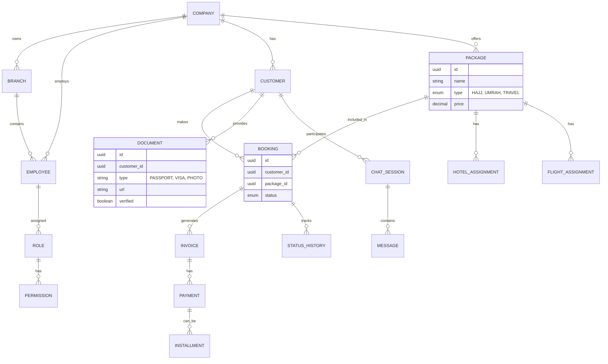

# Entity Relationship Diagram (ERD) - TravelOS AI

## Detailed Database Schema (Planned)

### Core
- `companies`: id, name, settings, subscription_tier.
- `branches`: id, company_id, name, address.
- `users`: id, email, password_hash, company_id, branch_id.
- `roles`: id, name, company_id.
- `permissions`: id, action, subject.

### CRM
- `customers`: id, company_id, name, phone (whatsapp), email, passport_no.
- `documents`: id, customer_id, type, file_path, ocr_data, is_verified.

### Bookings & Travel
- `packages`: id, company_id, title, description, price, total_slots, type.
- `bookings`: id, company_id, customer_id, package_id, status, total_amount, balance_due.
- `visa_applications`: id, booking_id, country, status, expiry_date.

### Finance
- `invoices`: id, booking_id, amount, status.
- `payments`: id, invoice_id, amount, method, status, receipt_url.

### AI & Chat
- `chat_sessions`: id, customer_id, company_id, last_message_at.
- `messages`: id, session_id, sender_type (AI, CUSTOMER, AGENT), content, metadata.
- `ai_logs`: id, session_id, agent_name, prompt, response, tokens, confidence_score.
